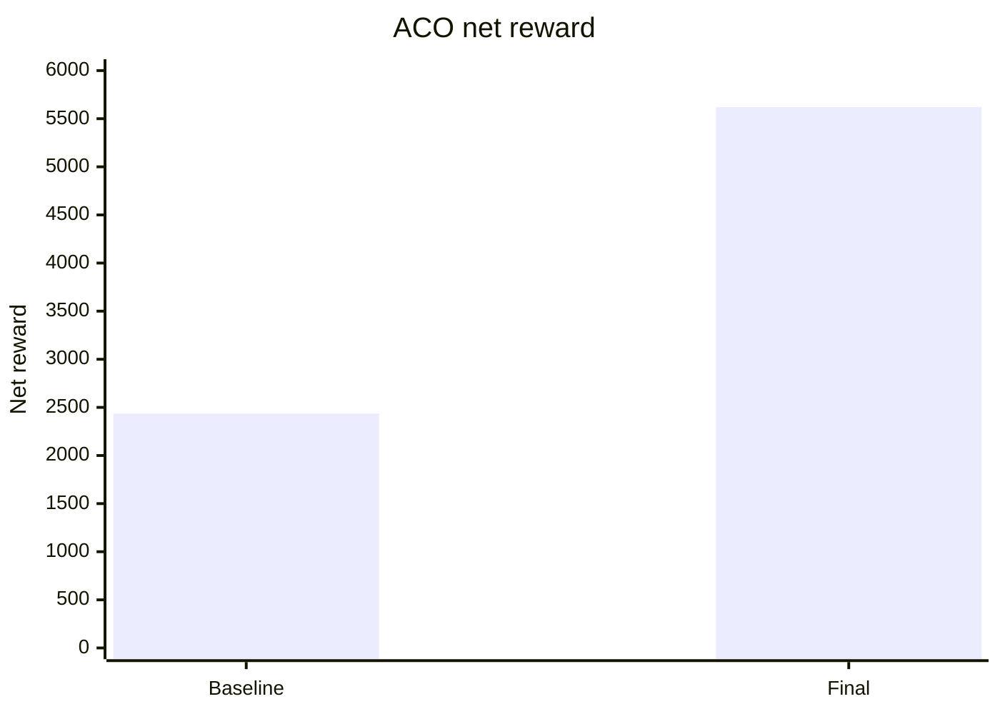

# Report ACO

Benchmark được chạy lại trên `test_config.txt` với seed mặc định của grader. Các phiên bản được so sánh:

- Baseline: `solvers/archive/aco_solver_baseline.py`
- Thuật toán cuối: `solvers/aco_solver.py`

## Giải thích bài toán ACO

Ant Colony Optimization, viết tắt là ACO, là metaheuristic mô phỏng cách đàn kiến tìm đường bằng pheromone. Trong bài toán giao hàng, một ant không phải là một shipper thật, mà là một lời giải giả lập dùng để thử phương án phân công đơn hàng ở timestep hiện tại.

Bài toán gốc là online MAPD: tại thời điểm `t`, solver chỉ thấy các đơn đã xuất hiện, trạng thái shipper và các đơn đang nằm trong túi. Vì đơn mới có thể sinh ở timestep sau, ACO không tối ưu toàn bộ horizon `T` một lần. Thuật toán được dùng theo rolling horizon:

```text
observation hiện tại -> nhiều ant thử phương án -> chọn plan tốt nhất -> đi 1 bước -> replan
```

Các thành phần ACO được ánh xạ như sau:

| Thành phần ACO | Ý nghĩa trong bài toán giao hàng |
|---|---|
| Ant | Một phương án giả lập gán đơn/route cho các shipper |
| Pheromone | Ký ức về lựa chọn tốt từ các iteration/timestep trước |
| Heuristic | Độ hấp dẫn tức thời của đơn, dựa trên reward, deadline, priority và khoảng cách |
| Evaporation | Giảm ảnh hưởng lựa chọn cũ để thích nghi với môi trường online |
| Deposit | Tăng pheromone cho order xuất hiện trong plan tốt |

Mục tiêu của ACO là cân bằng:

- **Exploration**: thử nhiều phương án khác nhau để tránh kẹt vào lựa chọn cục bộ.
- **Exploitation**: ưu tiên các order/route đã cho score tốt qua pheromone.

Điểm khó là pheromone theo `order_id` nhanh lỗi thời vì đơn sinh online. Do đó thuật toán cuối không chỉ dựa vào pheromone, mà còn dùng route search và replan liên tục để phản ứng với backlog mới.

## Tiêu chí đánh giá

| Tiêu chí | Ý nghĩa |
|---|---|
| `net_reward` | Điểm cuối cùng sau reward giao hàng và chi phí di chuyển |
| `delivered` | Số đơn giao được, phản ánh throughput |
| `missed` | Số đơn không giao được, phản ánh khả năng xử lý backlog |
| `late` | Số đơn giao trễ, phản ánh deadline awareness |
| `on_time_rate` | Tỷ lệ đúng hạn trên số đơn đã giao |
| `reward/delivered` | Điểm trung bình trên mỗi đơn giao |
| `runtime` | Thời gian chạy trên 6 config |

## Baseline

### Cách mô hình hóa

Bản đồ được mô hình hóa thành đồ thị lưới `G = (V, E)`, trong đó `V` là các ô trống và `E` là cạnh giữa hai ô kề nhau. Khoảng cách giữa shipper, pickup và delivery được tính bằng BFS.

ACO baseline xem bài toán tại mỗi timestep là bài toán gán pickup ngắn hạn:

- Shipper đang mang đơn chọn delivery bằng heuristic reward/deadline.
- Shipper rảnh được đưa vào ACO assignment.
- Mỗi ant xây một phương án `shipper_id -> order_id`, tức mỗi shipper nhận tối đa một pickup trong plan.
- Pheromone lưu theo cặp `(shipper_id, order_id)`.
- Sau mỗi iteration, pheromone bay hơi và plan tốt được deposit pheromone.
- Solver chỉ thực hiện bước đầu tiên, timestep sau replan.

Heuristic pickup baseline:

```text
heuristic =
(reward_proxy * priority_factor + slack_bonus)
/ (1 + pickup_distance + delivery_distance + lateness_penalty)
```

Assignment score:

```text
score =
6.0 * reward_proxy
+ 12.0 * priority
- pickup_distance
- 0.4 * delivery_distance
- 6.0 * lateness
```

### Phân tích độ phức tạp

Gọi `C` là số shipper rảnh, `M` là số đơn active, `M'` là số candidate sau lọc, `I` là số iteration, `A` là số ant, `V` là số ô hợp lệ và `E` là số cạnh.

- BFS distance: `O(V + E)`.
- Tạo candidate: `O(C * M * (V + E))` nếu phải tính khoảng cách mới.
- Mỗi ant xét các candidate cho từng shipper: `O(C * M')`.
- Tổng thời gian mỗi timestep xấp xỉ `O(I * A * C * M' * BFS_cost)`.
- Không gian: pheromone `O(C * M')`, cache khoảng cách và trạng thái ant.

Baseline là heuristic/metaheuristic, không đảm bảo tối ưu toàn cục vì chỉ chạy trong thời gian ngắn và chỉ nhìn thấy observation hiện tại.

### Cài đặt & kết quả

Code: `solvers/archive/aco_solver_baseline.py`

| Metric | Giá trị |
|---|---:|
| Net reward | 2435.91 |
| Delivered | 121/320 |
| Missed | 199 |
| Late | 20 |
| On-time rate | 83.47% |
| Reward/delivered | 20.13 |
| Runtime | 15.96s |

### Nhận xét

Baseline ACO tốt hơn greedy đơn giản ở khả năng thử nhiều assignment, nhưng throughput vẫn thấp. Solver chỉ giao `121/320` đơn và missed `199`, đặc biệt C5/C6 missed lần lượt `56` và `74`. Reward/delivered đạt `20.13`, nghĩa là các đơn được chọn tương đối có giá trị, nhưng tổng reward thấp vì bỏ lỡ quá nhiều đơn.

## Các phương án cải tiến dựa trên kết quả

Từ baseline, nút thắt chính là missed quá cao, không phải late. Do đó hướng cải tiến không nên chỉ tăng penalty deadline, mà cần tăng throughput và cho shipper xử lý nhiều đơn hơn trong cùng một vùng.

Các thay đổi chính được đưa vào final:

- Precompute all-pairs shortest path trên các ô trống để giảm chi phí truy vấn khoảng cách.
- Mỗi ant không chỉ gán một pickup, mà xây tập order ngắn hạn cho từng shipper.
- Dùng route search đệ quy/branch-and-bound để thử xen kẽ pickup và delivery.
- Pheromone vẫn lưu theo `(shipper_id, order_id)`, nhưng xác suất chọn order dựa trên gain khi thêm order vào route hiện tại.
- Giới hạn tìm kiếm bằng top 5 đơn gần vị trí cuối route để tránh bùng nổ tổ hợp.
- Dùng cooperative A* để tránh va chạm nhiều shipper ở bước path planning.
- Thêm centroid từ lịch sử pickup để reposition shipper idle ở map lớn.
- Dynamic parameters theo kích thước map để cân bằng runtime và reward.

## Thuật toán cuối

### Cách mô hình hóa

Thuật toán cuối vẫn giữ bản chất ACO: ant xây lời giải, pheromone điều hướng lựa chọn, pheromone bay hơi và lời giải tốt được deposit. Khác baseline, lời giải của ant là tập đơn và route ngắn hạn cho từng shipper.

Quy trình mỗi timestep:

1. Cập nhật lịch sử pickup và centroid động.
2. Khởi tạo assignment bằng các đơn shipper đang mang và target đã cam kết còn hợp lệ.
3. Với mỗi ant, shuffle thứ tự shipper để giảm thiên vị id.
4. Với từng shipper, thử thêm order vào tập assigned nếu còn capacity.
5. Chỉ xét top 5 order gần vị trí cuối route hiện tại.
6. Tính gain bằng `_solve_routing`: thêm order có làm route tăng net reward không.
7. Chọn order bằng trọng số pheromone và gain.
8. Bay hơi pheromone với `rho = 0.15`.
9. Deposit pheromone cho các order thuộc assignment tốt nhất.
10. Chạy cooperative A* để tạo path không xung đột và chỉ thực hiện action đầu tiên.

Trọng số chọn order:

```text
prob =
(pheromone(shipper_id, order_id) ^ alpha)
* (marginal_gain ^ beta)
```

Trong code final:

```text
alpha = 1.0
beta = 2.0
n_ants = 4
n_iterations = 3
rho = 0.15
```

Route search đánh giá cả pickup, delivery, reward đúng hạn/trễ, move cost, weight carried và centroid penalty. Với mỗi state route:

```text
net_reward = accumulated_delivery_reward
           + accumulated_move_cost
           - centroid_penalty
```

### Phân tích độ phức tạp

Gọi `F` là số ô trống, `C` là số shipper, `M` là số đơn active, `M'` là số candidate gần nhất được xét, `I` là số iteration, `A` là số ant và `L` là số order tối đa trong route.

- Precompute all-pairs BFS trong `__init__`: `O(F * (V + E))`, bộ nhớ `O(F^2)` trong trường hợp xấu.
- Mỗi timestep, ant construction: `O(I * A * C * M' * R(L))`, trong đó `R(L)` là chi phí route search có branch-and-bound.
- Cooperative A*: xấp xỉ `O(C * H * (V + E))`, với `H = max(35, 2N)`.
- Không gian: distance map `O(F^2)`, pheromone `O(C * M)`, routing cache theo `(shipper, order_set)`.

Thuật toán là near-optimal/heuristic trong rolling horizon: tốt hơn greedy cục bộ vì thử nhiều route, nhưng không đảm bảo tối ưu vì giới hạn ant, iteration, candidate và chỉ thực hiện một bước.

### Cài đặt & kết quả

Code: `solvers/aco_solver.py`

| Metric | Giá trị |
|---|---:|
| Net reward | 5621.15 |
| Delivered | 293/320 |
| Missed | 27 |
| Late | 31 |
| On-time rate | 89.42% |
| Reward/delivered | 19.18 |
| Runtime | 124.29s |

### Nhận xét

Thuật toán cuối cải thiện mạnh so với baseline vì giảm missed `199 -> 27` và tăng delivered `121 -> 293`. Late tăng `20 -> 31`, nhưng on-time rate vẫn tăng từ `83.47%` lên `89.42%`, cho thấy final không chỉ giao nhiều hơn mà còn bảo vệ deadline tốt hơn. Trade-off chính là runtime tăng từ `15.96s` lên `124.29s` do precompute all-pairs distance, route search và cooperative A*.

ACO final đạt `5621.15`, cao hơn GreedyBFS final `4081.92`, thỏa yêu cầu nâng cao của đề bài.

## Bảng tổng hợp

| Phiên bản | Net reward | Delivered | Missed | Late | On-time rate | Reward/delivered | Runtime |
|---|---:|---:|---:|---:|---:|---:|---:|
| Baseline | 2435.91 | 121/320 | 199 | 20 | 83.47% | 20.13 | 15.96s |
| Final | 5621.15 | 293/320 | 27 | 31 | 89.42% | 19.18 | 124.29s |

## Breakdown theo config

| Phiên bản | C1 | C2 | C3 | C4 | C5 | C6 | Tổng |
|---|---:|---:|---:|---:|---:|---:|---:|
| Baseline | 266.67 | 302.95 | 392.18 | 485.25 | 446.24 | 542.61 | 2435.91 |
| Final | 246.92 | 489.42 | 887.94 | 1028.49 | 1343.72 | 1624.67 | 5621.15 |

## Bảng định lượng theo từng config Phase 1

| Phiên bản | Config | Net reward | On-time rate | Runtime |
|---|---|---:|---:|---:|
| Baseline | C1 | 266.67 | 100.00% | 0.05s |
| Baseline | C2 | 302.95 | 94.12% | 0.28s |
| Baseline | C3 | 392.18 | 100.00% | 2.10s |
| Baseline | C4 | 485.25 | 70.00% | 5.36s |
| Baseline | C5 | 446.24 | 83.33% | 1.96s |
| Baseline | C6 | 542.61 | 76.92% | 6.20s |
| Final | C1 | 246.92 | 100.00% | 0.14s |
| Final | C2 | 489.42 | 100.00% | 1.03s |
| Final | C3 | 887.94 | 94.59% | 3.08s |
| Final | C4 | 1028.49 | 92.86% | 5.40s |
| Final | C5 | 1343.72 | 82.67% | 27.53s |
| Final | C6 | 1624.67 | 86.52% | 87.12s |

## Biểu đồ net reward



## Kết luận

Baseline ACO có tư duy metaheuristic nhưng vẫn bị giới hạn bởi assignment một pickup. Final chuyển sang route-level ACO, tính gain của việc thêm order vào route và dùng cooperative A* để giảm conflict. Cải tiến quan trọng nhất là throughput: missed giảm sâu từ `199` còn `27`. Điểm yếu còn lại là runtime cao; nếu cần tối ưu tiếp, nên giảm precompute/candidate trên config lớn hoặc dùng pheromone theo vùng thay vì theo order id.
