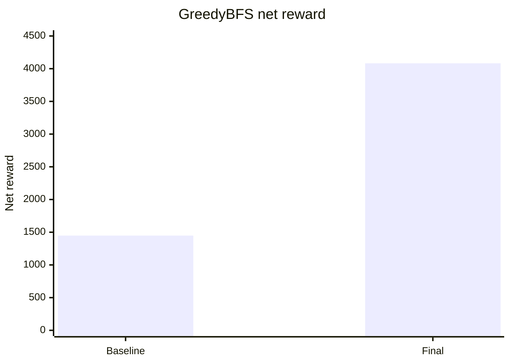

# Report GreedyBFS

Benchmark được chạy lại trên `test_config.txt` với seed mặc định của grader. Các phiên bản được so sánh:

- Baseline: `solvers/archive/greedy_bfs_baseline.py`
- Thuật toán cuối: `solvers/greedy_bfs.py`

## Giải thích bài toán Greedy BFS

Greedy BFS là baseline trực tiếp nhất cho bài toán giao hàng online. Thuật toán xem bản đồ là đồ thị lưới, dùng BFS để tính đường đi ngắn nhất, sau đó chọn hành động tốt nhất theo heuristic hiện tại. Điểm cốt lõi là solver không tối ưu một route dài cho toàn bộ horizon, mà lặp lại quyết định:

```text
quan sát hiện tại -> chọn target tốt nhất -> đi 1 bước bằng BFS -> replan
```

Ưu điểm của hướng này là đơn giản, chạy nhanh và ít rủi ro lỗi runtime. Nhược điểm là dễ bị cục bộ: shipper có thể đuổi theo đơn gần nhất nhưng bỏ lỡ đơn reward cao, deadline gấp hoặc các cụm đơn trong surge.

## Tiêu chí đánh giá

| Tiêu chí | Ý nghĩa |
|---|---|
| `net_reward` | Điểm cuối cùng sau reward giao hàng và chi phí di chuyển |
| `delivered` | Số đơn giao được |
| `missed` | Số đơn không giao được, phản ánh throughput |
| `late` | Số đơn giao trễ |
| `on_time_rate` | Tỷ lệ đúng hạn trên số đơn đã giao |
| `reward/delivered` | Điểm trung bình trên mỗi đơn giao |
| `runtime` | Thời gian chạy trên 6 config |

## Baseline

### Cách mô hình hóa

Bản đồ được mô hình hóa thành đồ thị `G = (V, E)`. Trong đó `V` là các ô trống không có vật cản, `E` là cạnh giữa hai ô kề nhau theo bốn hướng. Khoảng cách và bước đi kế tiếp đều được tính bằng BFS.

Tại mỗi timestep, thuật toán duyệt shipper theo thứ tự id tăng dần:

- Nếu shipper đang mang đơn: chọn đơn có điểm giao gần nhất.
- Nếu shipper không mang đơn: chọn đơn chưa nhặt có điểm lấy gần nhất và còn chở được.
- Nếu không có target phù hợp: đứng yên.

Tiêu chí delivery:

```text
min(distance_to_delivery, deadline, -priority, id)
```

Tiêu chí pickup:

```text
min(distance_to_pickup, -priority, deadline, id)
```

### Phân tích độ phức tạp

Gọi `C` là số shipper, `M` là số đơn active, `V` là số ô hợp lệ và `E` là số cạnh.

- Một lần BFS tốn `O(V + E)`.
- Mỗi shipper có thể duyệt qua toàn bộ đơn active để chọn pickup hoặc delivery.
- Thời gian mỗi timestep xấp xỉ `O(C * M * (V + E))`.
- Không gian phụ cho BFS là `O(V)`.
- Cache khoảng cách và next move giúp giảm lặp lại, nhưng worst-case vẫn phụ thuộc số cặp vị trí đã truy vấn.

Baseline là heuristic cục bộ, không đảm bảo optimal hoặc near-optimal. Deadline và priority chỉ đóng vai trò tie-break khi khoảng cách bằng nhau hoặc gần nhau.

### Cài đặt & kết quả

Code: `solvers/archive/greedy_bfs_baseline.py`

| Metric | Giá trị |
|---|---:|
| Net reward | 1447.98 |
| Delivered | 70/320 |
| Missed | 250 |
| Late | 12 |
| On-time rate | 82.86% |
| Reward/delivered | 20.69 |
| Runtime | 1.47s |

### Nhận xét

Baseline rất nhanh nhưng throughput thấp. Solver chỉ giao `70/320` đơn và missed `250`. C3-C6 đặc biệt yếu: missed lần lượt `32`, `50`, `71`, `90`. Reward/delivered khá cao vì thuật toán thường chỉ kịp giao các đơn dễ hoặc gần, nhưng tổng điểm thấp do bỏ lỡ phần lớn backlog.

## Các phương án cải tiến dựa trên kết quả

Từ số liệu baseline, vấn đề chính là missed quá cao. Vì vậy cải tiến cần ưu tiên giao nhiều đơn hơn, không chỉ giảm late.

Các thay đổi chính ở final:

- Vẫn dùng BFS làm lõi khoảng cách và đường đi.
- Thêm cache all-pairs distance trên các ô trống để truy vấn nhanh hơn trong runtime.
- Chọn delivery bằng score có xét deadline slack, priority và reward.
- Chọn pickup bằng score reward/distance thay vì chỉ pickup gần nhất.
- Có persistent target: shipper giữ target cũ nếu còn hợp lệ, tránh đổi hướng liên tục.
- Cho phép replan khi có đơn mới hoặc target không còn hợp lệ.
- Có xử lý stuck đơn giản: nếu shipper bị giữ nguyên vị trí nhiều bước, `_next_move` đảo thứ tự thử hướng để thoát kẹt.

## Thuật toán cuối

### Cách mô hình hóa

Final GreedyBFS vẫn là greedy+BFS, không chuyển sang ACO, CBS hay VRP. Điểm khác baseline là target được chọn bằng score có xét reward và deadline.

Quy trình mỗi timestep:

1. Nếu cần replan, kiểm tra target hiện tại của từng shipper.
2. Nếu shipper đang đứng ở delivery của đơn đang mang, ưu tiên giao.
3. Nếu shipper đang mang đơn, chọn delivery bằng urgency score.
4. Nếu shipper còn capacity, chọn pickup bằng score reward trên tổng khoảng cách.
5. Lưu target vào `_targets` để tránh đổi target liên tục.
6. Dùng BFS/next move để đi một bước về target.
7. Nếu bước đi tới đúng pickup thì `cargo_op = 1`; nếu tới delivery thì `cargo_op = 2`.

Delivery urgency score trong code ưu tiên:

```text
(slack_after_move, -priority, -reward_proxy, distance, order_id)
```

Pickup score có dạng:

```text
score = reward_proxy / max(pickup_distance + delivery_distance, 1)
```

với reward proxy:

```text
reward_proxy = alpha(priority) * r_base(weight)
```

### Phân tích độ phức tạp

Final precompute distance từ mỗi ô trống:

- Precompute: `O(F * (V + E))`, với `F` là số ô trống.
- Bộ nhớ distance map: `O(F^2)` worst-case.
- Mỗi timestep chọn target: `O(C * M)` nếu khoảng cách đã có cache.
- Sinh action: `O(C)` sau khi đã có next move hoặc cache path.

So với baseline, final chuyển chi phí BFS sang giai đoạn khởi tạo và dùng scoring nhanh hơn trong từng timestep. Đây vẫn là heuristic greedy, không đảm bảo tối ưu toàn cục.

### Cài đặt & kết quả

Code: `solvers/greedy_bfs.py`

| Metric | Giá trị |
|---|---:|
| Net reward | 4081.92 |
| Delivered | 234/320 |
| Missed | 86 |
| Late | 43 |
| On-time rate | 81.62% |
| Reward/delivered | 17.44 |
| Runtime | 0.76s |

### Nhận xét

Final tăng net reward từ `1447.98` lên `4081.92`, chủ yếu nhờ delivered tăng `70 -> 234` và missed giảm `250 -> 86`. Late tăng `12 -> 43` vì solver giao thêm nhiều đơn hơn; reward/delivered giảm `20.69 -> 17.44` vì thuật toán nhận thêm các đơn khó hoặc điểm thấp hơn để tăng throughput.

Điểm yếu còn lại là C3 và C6. C3 final chỉ giao `7/40`, thấp hơn baseline `8/40`, cho thấy heuristic hiện tại có thể không ổn định trên một số map. Vì GreedyBFS không lập route toàn cục và không xử lý xung đột sâu, nó phù hợp làm baseline mạnh vừa phải, không phải solver ranking chính.

## Bảng tổng hợp

| Phiên bản | Net reward | Delivered | Missed | Late | On-time rate | Reward/delivered | Runtime |
|---|---:|---:|---:|---:|---:|---:|---:|
| Baseline | 1447.98 | 70/320 | 250 | 12 | 82.86% | 20.69 | 1.47s |
| Final | 4081.92 | 234/320 | 86 | 43 | 81.62% | 17.44 | 0.76s |

## Breakdown theo config

| Phiên bản | C1 | C2 | C3 | C4 | C5 | C6 | Tổng |
|---|---:|---:|---:|---:|---:|---:|---:|
| Baseline | 200.35 | 424.59 | 299.99 | 204.77 | 137.35 | 180.93 | 1447.98 |
| Final | 264.86 | 425.78 | 217.99 | 881.74 | 1157.31 | 1134.24 | 4081.92 |

## Bảng định lượng theo từng config Phase 1

| Phiên bản | Config | Net reward | On-time rate | Runtime |
|---|---|---:|---:|---:|
| Baseline | C1 | 200.35 | 88.89% | 0.03s |
| Baseline | C2 | 424.59 | 83.33% | 0.05s |
| Baseline | C3 | 299.99 | 100.00% | 0.10s |
| Baseline | C4 | 204.77 | 90.00% | 0.25s |
| Baseline | C5 | 137.35 | 77.78% | 0.41s |
| Baseline | C6 | 180.93 | 60.00% | 0.64s |
| Final | C1 | 264.86 | 100.00% | 0.02s |
| Final | C2 | 425.78 | 91.30% | 0.02s |
| Final | C3 | 217.99 | 85.71% | 0.05s |
| Final | C4 | 881.74 | 84.31% | 0.12s |
| Final | C5 | 1157.31 | 75.71% | 0.22s |
| Final | C6 | 1134.24 | 78.57% | 0.32s |

## Biểu đồ net reward



## Kết luận

GreedyBFS baseline chứng minh nearest-first không đủ cho môi trường online có surge và deadline. Final vẫn giữ bản chất greedy+BFS nhưng cải thiện bằng reward-aware scoring, persistent target và cache distance. Cải tiến chính là throughput, nhưng thuật toán vẫn thiếu route planning và conflict reasoning nên thấp hơn ACO, MAPD-CBS và VRP-OrTools.
