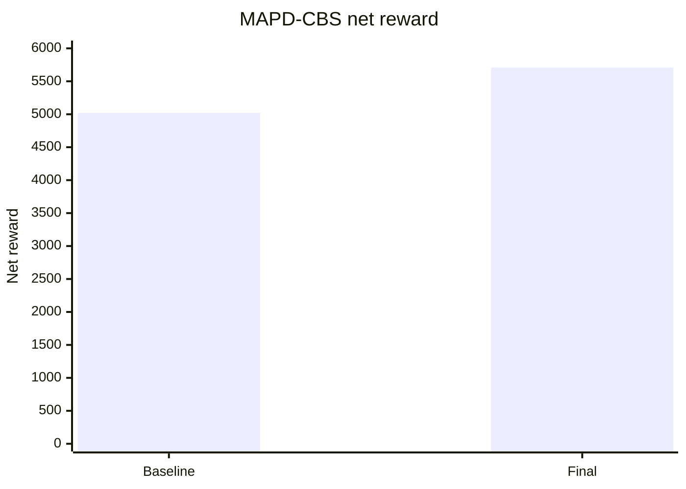

# Report MAPD-CBS

Benchmark được chạy lại trên `test_config.txt` với seed mặc định của grader. Các phiên bản được so sánh:

- Baseline: `solvers/archive/mapd_cbs_solver_baseline.py`
- Thuật toán cuối: `solvers/mapd_cbs_solver.py`

## Giải thích bài toán MAPD-CBS

MAPD-CBS kết hợp hai bài toán:

- **MAPD**: Multi-Agent Pickup and Delivery, tức nhiều shipper cùng nhận và giao đơn.
- **CBS**: Conflict-Based Search, dùng để lập đường đi đa tác tử và xử lý xung đột.

Trong bài toán này, solver không thể lập kế hoạch từ đầu đến cuối vì đơn sinh online. Do đó MAPD-CBS được dùng theo rolling horizon:

```text
observation -> gán target pickup/delivery -> lập path không xung đột -> đi 1 bước -> replan
```

Điểm khác so với GreedyBFS là MAPD-CBS không chỉ chọn target, mà còn kiểm tra xung đột trong không gian-thời gian. Một conflict có thể là:

- **Vertex conflict**: hai shipper muốn đứng cùng ô ở cùng timestep.
- **Edge conflict**: hai shipper muốn đi ngược chiều qua cùng cạnh ở cùng timestep.

CBS xử lý conflict bằng cách thêm constraint cho một shipper rồi tìm lại đường đi.

## Tiêu chí đánh giá

| Tiêu chí | Ý nghĩa |
|---|---|
| `net_reward` | Điểm cuối cùng sau reward giao hàng và chi phí di chuyển |
| `delivered` | Số đơn giao được |
| `missed` | Số đơn không giao được |
| `late` | Số đơn giao trễ |
| `on_time_rate` | Tỷ lệ đúng hạn |
| `reward/delivered` | Điểm trung bình trên mỗi đơn giao |
| `runtime` | Thời gian chạy trên 6 config |

## Baseline

### Cách mô hình hóa

Baseline tách bài toán thành hai tầng:

```text
assignment layer -> bounded CBS path planning layer
```

Tầng assignment:

- Nếu shipper đang mang đơn, chọn delivery target.
- Nếu shipper rảnh hoặc còn capacity, chọn pickup target bằng score.
- Mỗi shipper có tối đa một target tại timestep hiện tại.

Tầng CBS:

- Mỗi shipper có start và target.
- BFS trong không gian-thời gian sinh path dài tối đa `horizon`.
- Nếu phát hiện vertex/edge conflict, thêm constraint cho shipper id lớn hơn.
- Replan path cho shipper bị constraint.
- Chỉ thực hiện bước đầu tiên, timestep sau replan.

Pickup score baseline:

```text
score =
reward_proxy
+ priority_bonus
- pickup_distance
- delivery_distance
- lateness_penalty
```

### Phân tích độ phức tạp

Gọi `C` là số shipper, `M` là số đơn active, `V` là số ô hợp lệ, `E` là số cạnh, `H` là horizon và `R` là số lần sửa conflict.

- Assignment scoring: `O(C * M * (V + E))` nếu khoảng cách BFS chưa cache.
- Space-time BFS cho một shipper: `O(H * (V + E))`.
- CBS repair: xấp xỉ `O(R * C * H * (V + E))`.
- Conflict detection trên path: `O(H * C^2)`.
- Không gian: paths `O(C * H)`, constraints `O(R)`, BFS parent/visited `O(H * V)`.

CBS đầy đủ có thể optimal cho MAPF với target cố định, nhưng phiên bản này bị giới hạn horizon và replan online nên là heuristic conflict-aware.

### Cài đặt & kết quả

Code: `solvers/archive/mapd_cbs_solver_baseline.py`

| Metric | Giá trị |
|---|---:|
| Net reward | 5019.66 |
| Delivered | 288/320 |
| Missed | 32 |
| Late | 60 |
| On-time rate | 79.17% |
| Reward/delivered | 17.43 |
| Runtime | 35.04s |

### Nhận xét

Baseline MAPD-CBS đã mạnh vì delivered đạt `288/320`, missed chỉ `32`. Điểm nghẽn không còn là throughput mà là deadline quality: late `60`, on-time rate `79.17%`. C5/C6 có late cao (`22`, `25`), cho thấy solver giao được nhiều nhưng chưa bảo vệ deadline đủ tốt khi backlog lớn.

## Các phương án cải tiến dựa trên kết quả

Từ baseline, hướng cải tiến phù hợp là giảm late và tăng reward/order, không cần thay đổi bản chất thuật toán.

Các thay đổi chính ở final:

- Assignment chuyển sang auction toàn cục: tạo nhiều cặp `(shipper, target)` rồi chọn theo score giảm dần.
- Delivery score xét reward, priority, deadline slack và distance.
- Pickup score thêm detour penalty nếu shipper đang mang hàng.
- Gom các đơn đang mang có cùng destination để có thể giao thuận lợi hơn.
- Walk-over delivery: nếu shipper đi ngang qua delivery hợp lệ, ưu tiên giao.
- Conflict handling giữ CBS bounded horizon, nhưng target quan trọng hơn được ưu tiên khi tranh chấp.
- Có debug trace trong code để phục vụ phân tích bottleneck, nhưng benchmark chính vẫn dựa vào grader.

## Thuật toán cuối

### Cách mô hình hóa

Final vẫn giữ mô hình MAPD-CBS:

```text
target assignment -> space-time path planning -> conflict repair -> execute first step
```

Quy trình mỗi timestep:

1. Tạo candidate delivery cho các shipper đang mang hàng.
2. Tạo candidate pickup cho order chưa nhặt và shipper còn capacity.
3. Chấm điểm candidate bằng reward, priority, deadline slack, khoảng cách và detour.
4. Sắp xếp candidate theo score giảm dần.
5. Gán target sao cho một shipper chỉ nhận một target và một pickup không bị nhiều shipper tranh.
6. Chạy bounded CBS với horizon:

```text
horizon = min(18, max(6, 2 * N))
```

7. Phát hiện vertex/edge conflict trong path.
8. Thêm constraint cho shipper cần nhường và replan.
9. Sinh action đầu tiên từ path.

Delivery score có dạng:

```text
score =
reward_proxy
+ priority_bonus
+ urgency_bonus
- distance_cost
- lateness_penalty
```

Pickup score có thêm:

```text
detour_penalty
capacity_check
delivery_after_pickup_risk
```

### Phân tích độ phức tạp

Final có cùng bậc độ phức tạp với baseline nhưng scoring assignment nặng hơn:

- Candidate scoring: `O(C * M * BFS_cost)`.
- CBS path search: `O(R * C * H * (V + E))`.
- Conflict detection: `O(H * C^2)`.
- Không gian: `O(C * H + H * V + R)`.

Mức độ tối ưu: heuristic conflict-aware. Assignment không optimal toàn cục, CBS bị giới hạn horizon, nhưng có xử lý xung đột rõ ràng và phù hợp với môi trường online.

### Cài đặt & kết quả

Code: `solvers/mapd_cbs_solver.py`

| Metric | Giá trị |
|---|---:|
| Net reward | 5708.37 |
| Delivered | 295/320 |
| Missed | 25 |
| Late | 35 |
| On-time rate | 88.14% |
| Reward/delivered | 19.35 |
| Runtime | 33.45s |

### Nhận xét

Final tăng net reward `5019.66 -> 5708.37`. Delivered tăng nhẹ `288 -> 295`, nhưng cải thiện quan trọng hơn là late giảm `60 -> 35` và reward/delivered tăng `17.43 -> 19.35`. Điều này đúng với nhận xét từ baseline: MAPD-CBS không thiếu throughput quá nhiều, mà cần chọn target tốt hơn và giảm trễ.

Runtime giảm nhẹ từ `35.04s` xuống `33.45s`, nghĩa là cải tiến score không làm solver chậm hơn trên Phase 1.

## Bảng tổng hợp

| Phiên bản | Net reward | Delivered | Missed | Late | On-time rate | Reward/delivered | Runtime |
|---|---:|---:|---:|---:|---:|---:|---:|
| Baseline | 5019.66 | 288/320 | 32 | 60 | 79.17% | 17.43 | 35.04s |
| Final | 5708.37 | 295/320 | 25 | 35 | 88.14% | 19.35 | 33.45s |

## Breakdown theo config

| Phiên bản | C1 | C2 | C3 | C4 | C5 | C6 | Tổng |
|---|---:|---:|---:|---:|---:|---:|---:|
| Baseline | 261.01 | 409.83 | 833.19 | 956.97 | 1109.63 | 1449.03 | 5019.66 |
| Final | 260.96 | 465.48 | 914.60 | 1023.87 | 1372.28 | 1671.19 | 5708.37 |

## Bảng định lượng theo từng config Phase 1

| Phiên bản | Config | Net reward | On-time rate | Runtime |
|---|---|---:|---:|---:|
| Baseline | C1 | 261.01 | 100.00% | 0.06s |
| Baseline | C2 | 409.83 | 81.82% | 0.30s |
| Baseline | C3 | 833.19 | 88.89% | 1.65s |
| Baseline | C4 | 956.97 | 90.74% | 5.15s |
| Baseline | C5 | 1109.63 | 70.27% | 11.87s |
| Baseline | C6 | 1449.03 | 71.91% | 16.01s |
| Final | C1 | 260.96 | 100.00% | 0.07s |
| Final | C2 | 465.48 | 91.67% | 0.25s |
| Final | C3 | 914.60 | 91.89% | 0.96s |
| Final | C4 | 1023.87 | 91.07% | 5.50s |
| Final | C5 | 1372.28 | 83.78% | 10.93s |
| Final | C6 | 1671.19 | 85.71% | 15.74s |

## Biểu đồ net reward



## Kết luận

MAPD-CBS là thuật toán thể hiện rõ nhất yêu cầu xử lý xung đột đa tác tử. Baseline đã giao được nhiều đơn, còn final cải thiện chất lượng assignment và deadline awareness. Kết quả tăng chủ yếu đến từ giảm late và tăng reward/delivered, không chỉ từ tăng delivered.
