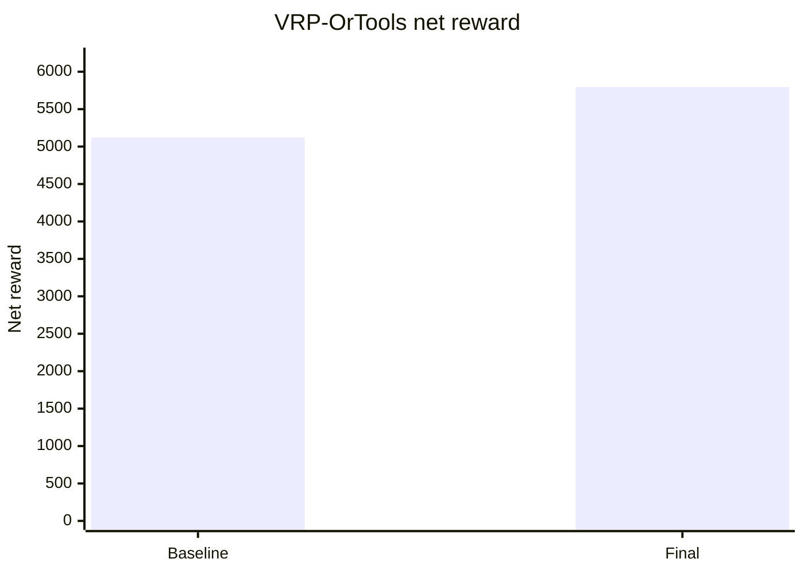

# Report VRP-OrTools

Benchmark được chạy lại trên `test_config.txt` với seed mặc định của grader. Các phiên bản được so sánh:

- Baseline: `solvers/archive/vrp_ortools.py`
- Thuật toán cuối: `solvers/vrp_ortools.py`

## Giải thích bài toán VRP-OrTools

Vehicle Routing Problem, viết tắt là VRP, là bài toán lập tuyến cho nhiều phương tiện để phục vụ nhiều yêu cầu. Trong bài toán này, shipper tương ứng với vehicle, đơn hàng là pickup-delivery request, và bản đồ lưới cung cấp khoảng cách giữa các node.

Bản đầy đủ của bài toán gần với Pickup and Delivery Problem with Time Windows and Capacity:

```text
vehicle/shipper -> pickup node -> delivery node
```

với các ràng buộc:

- pickup phải xảy ra trước delivery;
- pickup và delivery của cùng đơn phải do cùng shipper thực hiện;
- shipper không vượt quá tải trọng và số đơn tối đa;
- deadline ảnh hưởng reward;
- solver chỉ thấy đơn đã xuất hiện tại thời điểm hiện tại.

Vì môi trường online, VRP không được giải một lần cho toàn bộ `T`. Solver dùng rolling horizon:

```text
observation hiện tại -> tạo bài toán VRP nhỏ -> chọn bước đầu tiên -> replan
```

## Tiêu chí đánh giá

| Tiêu chí | Ý nghĩa |
|---|---|
| `net_reward` | Điểm cuối cùng sau reward giao hàng và chi phí di chuyển |
| `delivered` | Số đơn giao được |
| `missed` | Số đơn không giao được |
| `late` | Số đơn giao trễ |
| `on_time_rate` | Tỷ lệ đúng hạn |
| `reward/delivered` | Điểm trung bình trên mỗi đơn giao |
| `runtime` | Thời gian chạy trên 6 config |

## Baseline

### Cách mô hình hóa

Baseline trong `solvers/archive/vrp_ortools.py` dùng OR-Tools nếu thư viện khả dụng. Mỗi timestep, solver tạo một bài toán Pickup and Delivery nhỏ:

- Mỗi shipper là một vehicle.
- Mỗi order có pickup node và delivery node.
- OR-Tools thêm constraint pickup-delivery:
  - cùng vehicle;
  - pickup trước delivery theo dimension distance;
  - capacity theo trọng lượng;
  - capacity theo số đơn.
- Candidate order được giới hạn `12` đơn tốt nhất để giữ runtime.
- Search dùng `PATH_CHEAPEST_ARC`, `GUIDED_LOCAL_SEARCH` và time limit `25ms`.
- Nếu OR-Tools không trả lời giải, solver fallback sang pickup heuristic.
- Sau khi có target, solver dùng CBS ngắn hạn để giảm conflict.

Baseline này là mô hình VRP/PDP rõ ràng nhất, nhưng vì phải tạo model nhiều lần trong môi trường online nên runtime cao hơn heuristic thuần.

### Phân tích độ phức tạp

VRP/PDP là NP-hard. Với `n` order candidate, số node khoảng `2n + C`. OR-Tools không duyệt exhaustive trong time limit, nhưng chi phí vẫn phụ thuộc mạnh vào `n`, số vehicle và số constraint.

- Tính khoảng cách BFS giữa node: có thể tốn `O(n^2 * (V + E))` nếu chưa cache.
- Distance matrix: `O(n^2)` bộ nhớ.
- OR-Tools routing search: không có bound đa thức chặt trong thực tế vì dùng heuristic/metaheuristic.
- CBS sau OR-Tools: `O(R * C * H * (V + E))`.

Mức độ tối ưu: near-optimal cho bài toán con nếu solver có đủ thời gian, nhưng trong code bị giới hạn time limit nên là heuristic VRP online.

### Cài đặt & kết quả

Code: `solvers/archive/vrp_ortools.py`

| Metric | Giá trị |
|---|---:|
| Net reward | 5120.86 |
| Delivered | 290/320 |
| Missed | 30 |
| Late | 54 |
| On-time rate | 81.38% |
| Reward/delivered | 17.66 |
| Runtime | 80.57s |

### Nhận xét

Baseline VRP-OrTools có throughput cao: delivered `290/320`, missed chỉ `30`. Điểm yếu chính là late `54` và runtime `80.57s`. Điều này cho thấy OR-Tools giúp phân công nhiều đơn, nhưng time-window/reward của bài toán gốc chưa được tối ưu trực tiếp trong model; đồng thời chi phí gọi solver lặp lại ở nhiều timestep khá lớn.

## Các phương án cải tiến dựa trên kết quả

Từ baseline, hướng cải tiến cần tập trung vào:

- giảm late;
- tăng reward/delivered;
- giảm runtime do không gọi OR-Tools liên tục;
- phản ứng tốt hơn với hotspot/surge bằng repositioning.

Các thay đổi chính ở final:

- Không trực tiếp import OR-Tools trong final; giữ tư duy VRP nhưng thay bằng route evaluation heuristic.
- Dùng SSSP BFS cache từ mỗi vị trí nguồn để truy vấn khoảng cách nhanh.
- Đánh giá route bằng reward thật gần với môi trường: đúng hạn/trễ, move cost, carried weight.
- Tối ưu route cho các đơn đang mang trước, sau đó chèn thêm pickup khả thi.
- Stale filter loại các đơn quá trễ theo priority (`stale_p3`, `stale_p2`, `stale_p1`).
- Heat-map estimator mô hình hóa hotspot bằng heat injection, decay và diffusion.
- Reposition shipper idle về vùng heat/density cao, có tính congestion để tránh dồn quá đông.
- Dynamic parameter theo kích thước map để cân bằng deadline margin và runtime.

## Thuật toán cuối

### Cách mô hình hóa

Final vẫn là solver VRP-style: với mỗi shipper, thuật toán tìm route ngắn hạn tốt nhất gồm các event pickup/delivery, nhưng tự đánh giá route thay vì gọi OR-Tools.

Quy trình mỗi timestep:

1. Cập nhật heat map từ các order active.
2. Với shipper đang mang hàng, tìm route giao các đơn trong bag.
3. Lọc order chưa nhặt bằng stale filter và capacity.
4. Với mỗi order, chọn một số shipper candidate gần nhất.
5. Thử chèn order vào route của shipper candidate.
6. Dùng `_evaluate_route` để tính net score của route.
7. Chấp nhận insertion nếu tăng score và không phá deadline quá mạnh.
8. Nếu shipper idle, reposition về hot cell hoặc vùng density cao.
9. Chuyển route thành action đầu tiên rồi replan ở timestep sau.

Route score xét:

```text
delivery_reward
+ move_cost
- lateness_risk
- stale_penalty
+ heat/density benefit for repositioning
```

Heat map hoạt động như sau:

```text
order active tại pickup -> inject heat theo priority
heat decay theo thời gian
heat diffusion sang ô lân cận
shipper idle đi về ô có heat/distance tốt nhất
```

### Phân tích độ phức tạp

Gọi `M` là số order active, `C` là số shipper, `L` là độ dài route tối đa và `P` là số vị trí đã cache SSSP.

- SSSP BFS một nguồn: `O(V + E)`.
- Cache khoảng cách: bộ nhớ tối đa `O(P * V)`.
- Candidate shipper mapping: `O(M * C)` nếu distance đã cache.
- Route insertion/evaluation: xấp xỉ `O(M * C_candidate * R(L))`.
- Heat map update: phụ thuộc số ô nóng, thường nhỏ hơn `O(V)`, worst-case `O(V)`.

Thuật toán là heuristic VRP online. Nó không còn optimal như một model OR-Tools đầy đủ, nhưng đổi lại nhanh hơn và trực tiếp tối ưu reward/deadline của môi trường.

### Cài đặt & kết quả

Code: `solvers/vrp_ortools.py`

| Metric | Giá trị |
|---|---:|
| Net reward | 5794.99 |
| Delivered | 296/320 |
| Missed | 24 |
| Late | 22 |
| On-time rate | 92.57% |
| Reward/delivered | 19.58 |
| Runtime | 1.65s |

### Nhận xét

Final cải thiện cả chất lượng và tốc độ. Net reward tăng `5120.86 -> 5794.99`, delivered tăng `290 -> 296`, missed giảm `30 -> 24`, late giảm mạnh `54 -> 22`, on-time rate tăng `81.38% -> 92.57%`. Runtime giảm từ `80.57s` xuống `1.65s` vì không còn tạo model OR-Tools liên tục.

Điểm cần viết trung thực trong báo cáo: baseline dùng OR-Tools, còn final là VRP-style adaptive route heuristic và không trực tiếp import OR-Tools. Tên class vẫn là `VRPOrToolsSolver` để tương thích grader.

## Bảng tổng hợp

| Phiên bản | Net reward | Delivered | Missed | Late | On-time rate | Reward/delivered | Runtime |
|---|---:|---:|---:|---:|---:|---:|---:|
| Baseline | 5120.86 | 290/320 | 30 | 54 | 81.38% | 17.66 | 80.57s |
| Final | 5794.99 | 296/320 | 24 | 22 | 92.57% | 19.58 | 1.65s |

## Breakdown theo config

| Phiên bản | C1 | C2 | C3 | C4 | C5 | C6 | Tổng |
|---|---:|---:|---:|---:|---:|---:|---:|
| Baseline | 266.46 | 460.29 | 880.58 | 902.21 | 1209.62 | 1401.70 | 5120.86 |
| Final | 264.35 | 465.95 | 888.14 | 1046.49 | 1439.33 | 1690.72 | 5794.99 |

## Bảng định lượng theo từng config Phase 1

| Phiên bản | Config | Net reward | On-time rate | Runtime |
|---|---|---:|---:|---:|
| Baseline | C1 | 266.46 | 100.00% | 1.84s |
| Baseline | C2 | 460.29 | 95.83% | 3.46s |
| Baseline | C3 | 880.58 | 91.89% | 7.07s |
| Baseline | C4 | 902.21 | 82.69% | 16.15s |
| Baseline | C5 | 1209.62 | 73.33% | 21.97s |
| Baseline | C6 | 1401.70 | 76.40% | 30.08s |
| Final | C1 | 264.35 | 100.00% | 0.03s |
| Final | C2 | 465.95 | 95.83% | 0.07s |
| Final | C3 | 888.14 | 94.59% | 0.12s |
| Final | C4 | 1046.49 | 94.64% | 0.26s |
| Final | C5 | 1439.33 | 88.00% | 0.43s |
| Final | C6 | 1690.72 | 92.31% | 0.74s |

## Biểu đồ net reward



## Kết luận

Baseline OR-Tools mô hình hóa đúng tinh thần VRP/PDP nhưng runtime cao và deadline chưa đủ tốt. Final giữ tư duy route-level VRP, thay solver nặng bằng route evaluation chuyên biệt cho reward của đề bài, đồng thời thêm heat-map repositioning để phản ứng với hotspot. Đây là thuật toán final tốt nhất trong bốn solver trên Phase 1.
